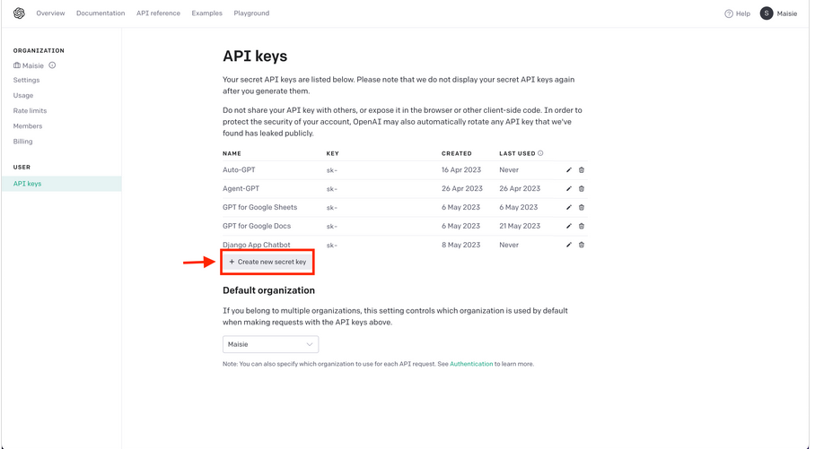
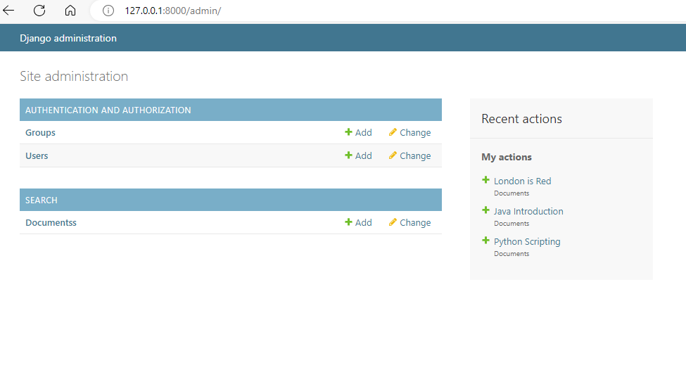
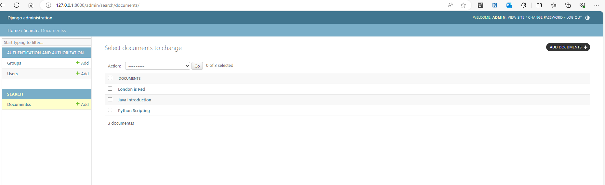
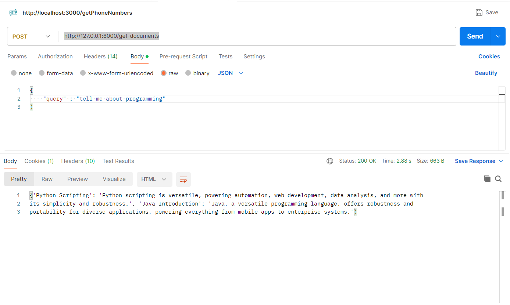
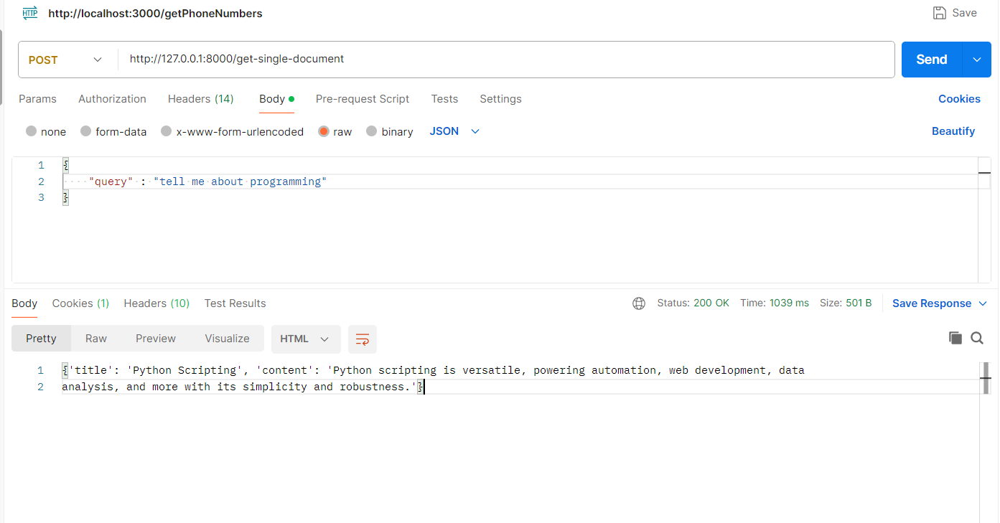

### Installation

Provision the necessary AWS services needed for running the application:

1. Create Virtual environment in the document_search directory => " virtualenv venv"
2. activate virtual environment => " venv\Scripts\activate"
3. install requirements from requirements.txt => "pip install -r requirements.txt "
4. generate api_key from open_ai

5. replace the generated key in the .env file
6. run the command to make db models migrations files => "python manage.py makemigrations"
7. run the command to make db models migrations  => "python manage.py migrate"
8. run the app => "python manage.py runserver"

## use the admin view to add data 

1. go to the following path to get admin panel view to add data in the db model => " http://127.0.0.1:8000/admin"

2. add data to the documents model 

There are no Unit test on the back-end

### Use the enpoints on postman:

1. get all documents related to my query = > "http://127.0.0.1:8000/get-documents"

2. get top ranked document related to my query = > "http://127.0.0.1:8000/get-single-document"

